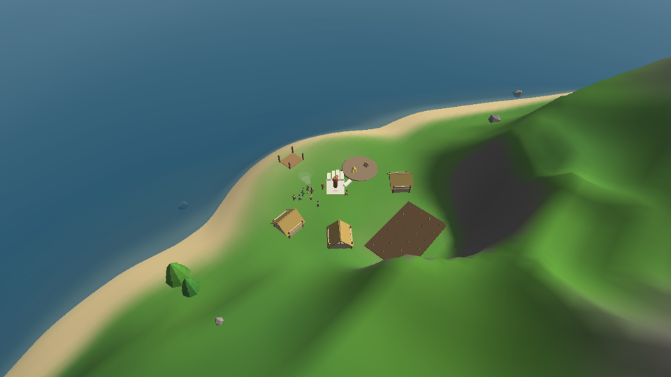
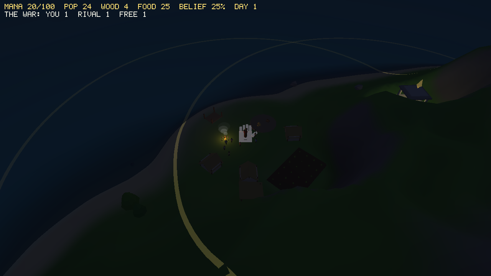
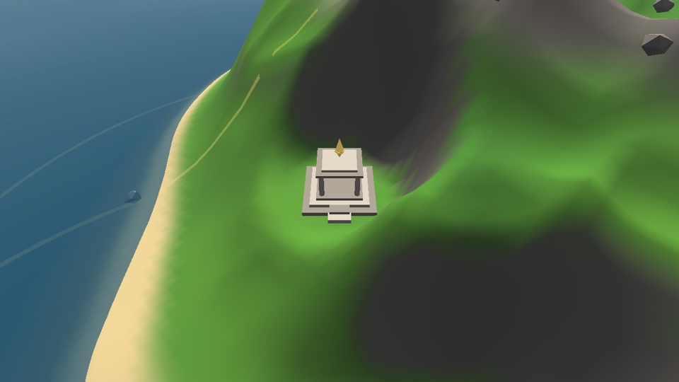
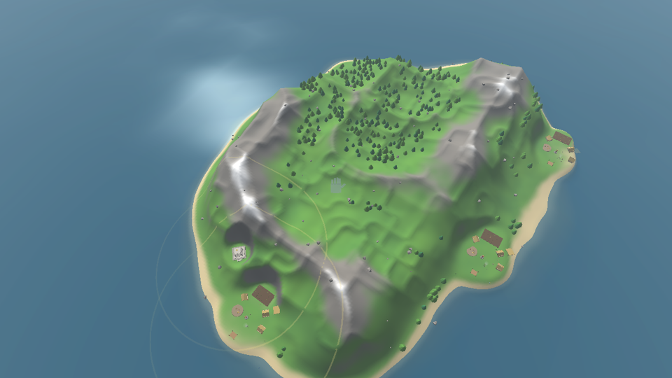

# godgame

A Black & White inspired god game, written from scratch in C++ / OpenGL / SDL2.
Personal project — the code is an original recreation, and original game assets
(from a personally owned copy) may be wired in later. Everything currently on
screen is procedural placeholder art. There is no creature, by design.






## Current slice: worship, belief & the temple

The god-game loop is closed (design docs: [villagers](docs/plan-villagers.md),
[worship](docs/plan-worship.md)): worshippers dance at the village totem →
**mana** fills the pool at your **temple** → you cast **miracles** → villagers
who witness them **believe** → belief widens your **influence rings** and
speeds worship.

- **Worshippers** — drop a villager onto the village-center totem to devote
  them. They dance in a circle around it (prayer motes rising, totem glowing),
  generating mana scaled by belief — but dancing is hungry work, so every
  worshipper is a worker you gave up who still eats from the pile.
- **Belief** — grows when villagers witness divine acts (grabs a little,
  throws more, gifts dropped on the storage pad, miracles most of all) and
  decays toward a floor when you're absent. It scales worship output and the
  village influence radius.
- **The temple** — the god's seat, founded apart from the village on its own
  terrace. Its floating gold beacon shows the mana pool at a glance and
  projects the base influence ring.
- **Influence** — the hand only highlights, grabs, and casts *inside* the
  gold rings; outside it turns ghostly and can only pan the camera. Faith
  literally extends your reach.
- **The food miracle** (`M` at the cursor, 30 mana) — food rains from the sky;
  villagers haul it to storage, witnesses believe harder.

## Previous slice: a living village

- **Villagers** — needs (hunger, energy), jobs (forester, farmer, fisherman,
  builder), and idle lives (wandering, chatting, sitting by the fire).
  Foresters fell trees with real physics and haul the logs home; farmers tend
  and harvest a crop field; fishermen cast from shore spots; builders haul
  wood and raise new houses through visible construction stages. Surplus food
  means children at dawn.
- **The hand and the people** — pick villagers up (they flail and panic),
  throw them (they tumble, get stunned, stagger up, and flee), or set them
  down gently *on* something to assign a job: trees → forester, the field →
  farmer, water → fisherman, a construction site → builder. Drop logs, food,
  or entire uprooted trees onto the storage pad to stock the village.
  Villagers notice the hand looming and cower if they've learned to fear it.
- **Day & night** — the sun arcs across the sky, dusk turns the fog salmon,
  nights are dark with stars, window glow, and the campfire; villagers head
  home at dusk (the homeless curl up by the fire) and emerge at dawn.
- **Procedural island** — seeded heightfield (fBm + ridged noise, irregular
  coastline) with painterly coloring, animated ocean, and fog. The village
  founds itself on the best coastal terrace and gently terraforms it flat —
  same seed, same island, same village, on every platform.
- **The camera** — grab-the-land panning, zoom toward the cursor, orbit/tilt,
  pitch eased by altitude, just like the original.

There is no belief/worship yet (next slice) and villagers cannot die —
hard landings stun instead. The mortality seams are in place for later.

## Controls

| Input | Action |
| --- | --- |
| Left-drag on ground | Pan (grab the land) |
| Left-drag on thing | Pick up rock / tree / log / food / **villager** |
| ...release while still | Set down — on trees/field/water/site = assign job |
| ...release mid-motion | Throw |
| Right- or middle-drag | Rotate & tilt camera |
| Mouse wheel | Zoom toward cursor |
| `W A S D` / arrows | Move camera (Shift = faster) |
| `Q` / `E` | Rotate camera |
| `M` | Food miracle at the cursor (30 mana, inside influence) |
| `T` | Advance time of day |
| `R` | Generate a new island |
| `F2` | Wireframe |
| `Esc` | Quit |

Debug/tuning: `F3` tint villagers by AI state, `F4` sim speed ×1/4/16,
`K` spawn a villager at the hand, `L` +10 wood & food. Gameplay constants
live in `src/Tuning.h`.

## Building

Requires CMake 3.16+ and a C++20 compiler. SDL2 and glm are found on the
system when available and otherwise fetched and built automatically.

### Linux

```sh
sudo apt install libsdl2-dev libglm-dev   # optional but faster
cmake -B build && cmake --build build -j
./build/godgame
```

### Windows

Open the folder in Visual Studio (CMake project) or run:

```sh
cmake -B build
cmake --build build --config Release
build\Release\godgame.exe
```

The first configure downloads and builds SDL2; later builds are fast.

## Command line

```
godgame                       play
godgame --seed 1234           play a specific island
godgame --headless [steps]    no window: world-gen, physics, village economy,
                              hand-interaction and determinism self-tests
godgame --screenshot out.bmp [frames] [far|close|village|night]
```

## Roadmap

The full arc to the real game — **skirmish against AI gods on handcrafted
maps**, won by converting villages until the enemy temple falls — is laid out
in [docs/plan-game.md](docs/plan-game.md). The short version:

1. Scaffolds & the buildable village (workshops craft scaffolds; combine
   1-7 and place them: abodes, store, crèche, graveyard, field, village
   center, miracle dispenser, wonder)
2. Mortality & burial (population becomes a real resource)
3. Many villages (neutrals, the big multi-village refactor)
4. Gods & conversion (per-god belief, the ownership ratchet)
5. The rival AI god (fully symmetric, an embodied enemy hand)
6. In-game map editor → 7. skirmish shell → 8. balance — then story mode

Also on the list: more miracles, original B&W asset loaders, sound.

## Layout

```
src/
  main.cpp       app loop, input, rendering, placeholder models, CLI modes
  gl.h/.cpp      minimal OpenGL 3.3 core loader (via SDL_GL_GetProcAddress)
  Shader.*       shader compile/link + uniform helpers
  Mesh.*         interleaved VAO/VBO wrapper + primitive builders
  Models.*       village-slice mesh builders (villagers, buildings, bubbles)
  Noise.h        deterministic value noise / fBm / ridge + XorShift RNG
  Terrain.*      island heightfield: generate, flatten, sample, raycast, mesh
  Physics.*      ballistic sphere step shared by props and thrown villagers
  Water.*        animated transparent ocean
  Sky.*          gradient sky + sun, night palette + stars
  DayCycle.h     time of day: sim schedule + lighting curves
  Camera.*       B&W-style camera
  World.*        props (trees/rocks/logs/food), physics, scattering
  Village.*      settlement: founding, layout, buildings, farm, stores
  Villager.h     villager data (jobs, states, needs)
  Villagers.*    villager AI: priority ladder, job loops, steering, poses
  Hand.*         the divine hand: hover, grab, carry, throw, assign
  Tuning.h       every gameplay constant
```
