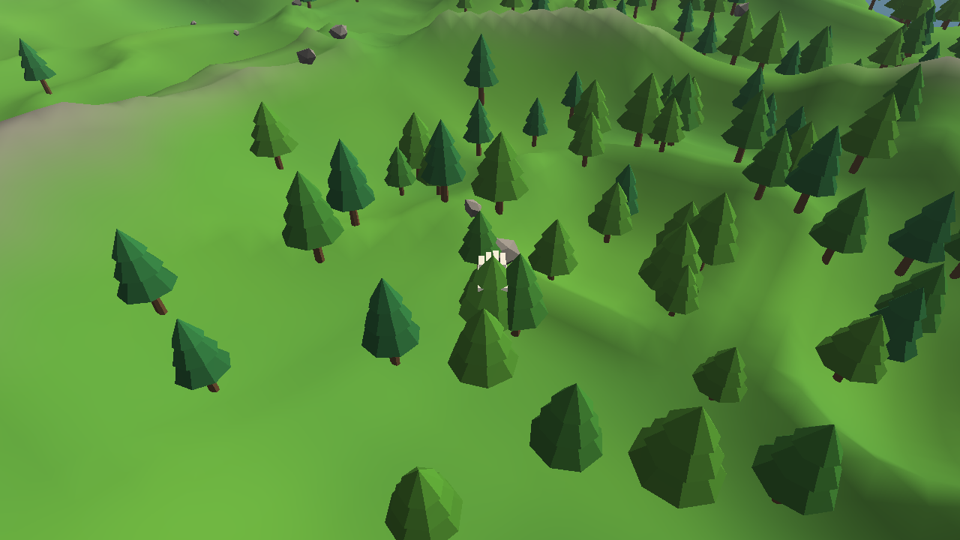

# godgame

A Black & White inspired god game, written from scratch in C++ / OpenGL / SDL2.
Personal project — the code is an original recreation, and original game assets
(from a personally owned copy) may be wired in later. Everything currently on
screen is procedural placeholder art. There is no creature, by design.




## Current slice: land, camera, hand

- **Procedural island** — seeded heightfield (fBm + ridged noise, irregular
  coastline) with painterly beach / grass / rock / snow coloring, an animated
  ocean, gradient sky with sun, and distance fog.
- **The camera** — grab-the-land panning (the point you click stays under the
  cursor), zoom toward the cursor, orbit/tilt, and pitch that eases toward the
  horizon as you get close, just like the original.
- **The divine hand** — hovers along the terrain, picks up rocks and trees,
  and throws them with the velocity of your gesture. Props tumble, bounce off
  the terrain, float (trees) or sink (rocks) in water, and fallen trees slowly
  right themselves and replant.

## Controls

| Input | Action |
| --- | --- |
| Left-drag on ground | Pan (grab the land) |
| Left-drag on rock/tree | Pick up — release mid-motion to throw |
| Right- or middle-drag | Rotate & tilt camera |
| Mouse wheel | Zoom toward cursor |
| `W A S D` / arrows | Move camera (Shift = faster) |
| `Q` / `E` | Rotate camera |
| `R` | Generate a new island |
| `F2` | Wireframe |
| `Esc` | Quit |

## Building

Requires CMake 3.16+ and a C++20 compiler. SDL2 and glm are found on the
system when available and otherwise fetched and built automatically.

### Linux

```sh
sudo apt install libsdl2-dev libglm-dev   # optional but faster
cmake -B build && cmake --build build -j
./build/godgame
```

### Windows

Open the folder in Visual Studio (CMake project) or run:

```sh
cmake -B build
cmake --build build --config Release
build\Release\godgame.exe
```

The first configure downloads and builds SDL2; later builds are fast.

## Command line

```
godgame                       play
godgame --seed 1234           play a specific island
godgame --headless [steps]    no window: generate world, run physics self-test
godgame --screenshot out.bmp [frames] [far|close]   render and dump a BMP
```

## Roadmap

- Villagers: needs, jobs, houses, worship
- Miracles: gesture casting, water/fire/food
- Influence ring and belief
- Loaders for original Black & White data files (terrain, meshes, textures)
- Sound

## Layout

```
src/
  main.cpp     app loop, input, rendering, placeholder models, CLI modes
  gl.h/.cpp    minimal OpenGL 3.3 core loader (via SDL_GL_GetProcAddress)
  Shader.*     shader compile/link + uniform helpers
  Mesh.*       interleaved VAO/VBO wrapper + primitive builders
  Noise.h      deterministic value noise / fBm / ridge
  Terrain.*    island heightfield: generate, sample, raycast, mesh
  Water.*      animated transparent ocean
  Sky.*        fullscreen gradient sky + sun
  Camera.*     B&W-style camera
  World.*      props (trees/rocks), physics, scattering
  Hand.*       the divine hand: hover, grab, carry, throw
```
