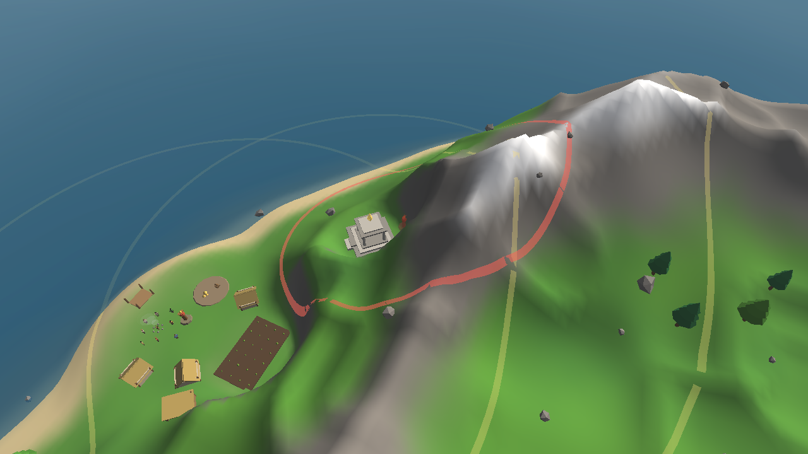
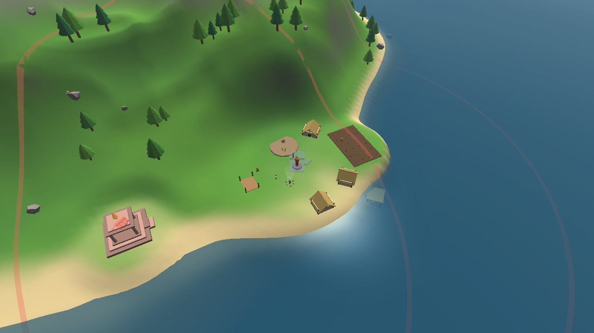
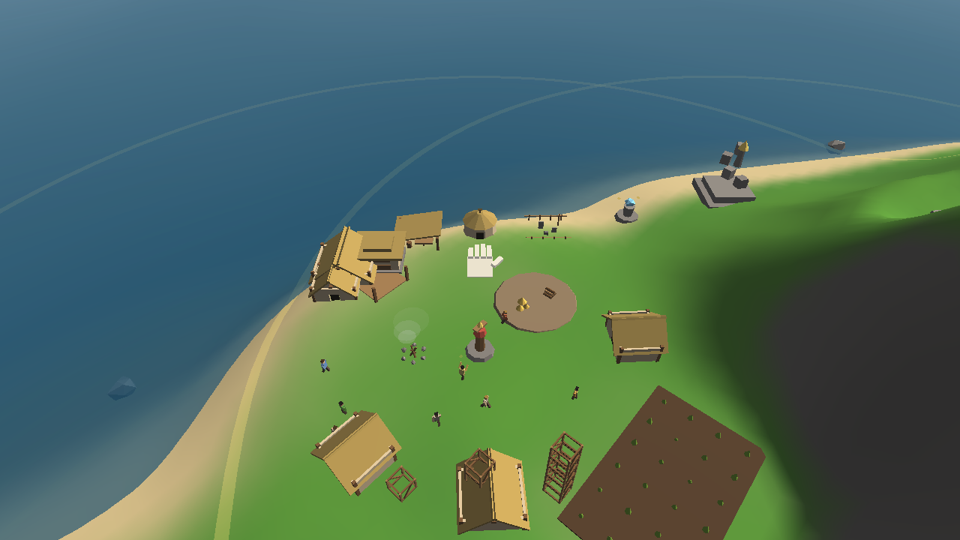

# godgame

A Black & White inspired god game, written from scratch in C++ / OpenGL / SDL2.
Personal project — the code is an original recreation, and original game assets
(from a personally owned copy) may be wired in later. Everything currently on
screen is procedural placeholder art. There is no creature, by design.


## Current slice: the map editor

Handcrafted worlds (design: [docs/plan-editor.md](docs/plan-editor.md)). Press
**Tab** and time freezes — the island becomes clay:



- **Sculpting**: raise, lower, flatten, and smooth brushes (`1`-`4`, `[` `]`
  for size) reshape the heightfield live; nearby props, buildings, and
  villagers re-seat on the new ground. Forest and rock brushes (`5`, `6`)
  plant; the eraser (`7`) clears.
- **Founding**: click villages into being (`8`) — `G` cycles the owner
  (you / the rival / neutral), `V` the size (small / medium / large
  population and stores). Seat temples with `9`. Placing a rival village or
  temple wakes the rival god, AI and all: a skirmish map is just a map that
  contains an opponent.
- **Frozen, honest authoring**: the sim halts in the editor; toggling either
  way rebuilds the world from the map, so playtests never dirty your map and
  every playtest is a fresh deterministic start. `N` starts from a blank
  flat island, `R` still rerolls a procedural one.
- **Map files**: `F5`/`F9` save/load `maps/slot<N>.gmap` (`F6` cycles
  slots), `--map file.gmap` plays any map, `--editor` boots straight into
  authoring. A `.gmap` is a *starting condition* — heightfield plus entity
  specs — and loading one rebuilds the world through the exact founding
  paths the generator uses: **a loaded map is bit-for-bit the world that was
  saved**, and save → load → save is byte-identical.

## Previous slice: the rival god

A second god plays the island (design: [docs/plan-rival.md](docs/plan-rival.md)).
Every new world is a **skirmish** now (`--no-rival` for the peaceful sandbox):



- **Fully symmetric, verbs only.** The rival founds its home village and
  temple on the site farthest from yours and plays through exactly the verbs
  you have — grabbing and dropping villagers to assign jobs, combining and
  placing scaffold stacks, casting food miracles, hurling gifts whose landing
  is credited to their sender. No economic cheats; its villages run the same
  simulation yours do.
- **An embodied enemy hand.** Everything it does is executed by a ghostly
  crimson hand that must fly to a thing before it can touch it — travel
  speed, decision cadence, and cooldowns are the difficulty knobs. Villagers
  fear it like they fear yours: they track the nearest looming hand, cower,
  and flee it.
- **Three layers of mind.** A per-village *governor* (keep worshippers
  dancing, feed empty larders, place growth scaffolds by need), a
  *strategos* (court the nearest neutral with gifts and — once its rings
  reach — miracles; pressure your weakest village when bold), and an
  *executor* (one order at a time, re-validated every phase — snatch its
  target first and it shrugs and replans).
- **A skirmish can be lost.** A god whose last village converts away is
  **broken**: its hand withdraws to its temple and hangs still. That fate is
  yours too — the ratchet doesn't care who it strips. (The temple-collapse
  ceremony and proper win/lose flow arrive with the skirmish shell, M7.)
- **The balance tool**: `godgame --match [days]` runs a deterministic
  AI-vs-AI skirmish headless and reports the war day by day — villages held,
  belief, mana, divine acts.

## Previous slice: gods & conversion

Belief is territory now (master plan: [docs/plan-game.md](docs/plan-game.md)).
Villages keep a belief score **per god**, and enough faith flips a village to
your side:

- **Per-god belief** — every divine act is attributed to the god who performed
  it: grabs, throws, gifts, burials, miracles. Witnesses credit *that* god.
  Deaths still terrify without crediting anyone, and they stain the owner's
  standing.
- **The conversion ratchet** — a neutral village joins the god whose belief
  clears 50 % with a clear lead over every rival. An *owned* village is far
  stickier: a challenger needs overwhelming faith (85 %) while the owner's has
  collapsed below 35 %. Conversion suppresses rival belief, scatters a few
  frightened villagers, and rings out an awe event for the new patron —
  villages change hands rarely, and it means something.
- **Converted villages are yours for real** — they project your influence
  rings, their totem accepts Worshippers, their dance feeds *your* mana pool,
  their store receives your gifts.
- **Hurled gifts remember their sender** — throw food or wood across the map
  into a neutral village and whoever picks it up (or the pile that absorbs
  it) believes a little more in *you*. That's the long-range conversion tool
  the influence rings can't reach.
- **Ownership on the map** — totems tint with their owner's color (the player
  is gold), and a conversion fires a pulse of light and a message.
- Under the hood: mana, temple, and influence all moved onto `World::gods[]`
  — the crimson rival god (M5) is a data change away.

## Previous slice: many villages

The strategic map exists. Every island now founds the player's home village
**plus neutral villages** on the best remaining sites (separated by 130 m+),
each running the same autonomous simulation — gathering, farming, building,
sleeping, raising children — with no god over them:

- **Neutral villages** have no Worshipper and generate no mana; their belief
  in you starts near zero. They sit outside your influence rings — visible,
  self-sufficient, and unreachable until your reach grows.
- **Witness routing**: every divine act now reaches whichever village saw
  it. Impress a neutral village's people and *their* belief in you rises.
- **Per-village everything**: stores, fields, claims, burials, births,
  economy counters. Prop claims are packed cross-village ids; villages and
  their villagers keep stable indices forever.
- **Spatial obstacle grid** for steering — cost per villager no longer scales
  with the island's prop count, ready for the crowds ahead.

## Previous slice: mortality & burial

Villagers can now die — and the dead demand dignity:

- **Three ways to go**: impacts above ~26 m/s (a hard throw or a long fall),
  drowning (~16 s of open-water swimming), and starvation (a day and a half
  at an empty larder). Gentle handling stays perfectly safe, and a villager
  held in the hand cannot die — the divine grip preserves.
- **Bodies are props**: they fall, float (grimly), and can be carried — by
  villagers or by you.
- **Burial**: with a Graveyard built, villagers drop what they're doing at
  the next task boundary to carry the dead there; a grave is dug (stone
  cairns accumulate) and belief mends a little. You can also lay a body to
  rest yourself. Corpses left rotting near the village drain belief instead.
- Every death costs belief and terrifies witnesses. Population is now a real
  resource: Crèche births against deaths, beds freed by the fallen.

## Previous slice: scaffolds & the buildable village

The growth engine from [docs/plan-game.md](docs/plan-game.md) (slice plan:
[docs/plan-scaffolds.md](docs/plan-scaffolds.md)) — wood becomes scaffolds
becomes the village you designed:



- **Workshops craft scaffolds**: builders with no construction to serve work
  the bench, turning 4 wood into a physical scaffold lattice (up to 3 waiting
  in the yard).
- **Combine by hand**: gently place one scaffold onto another to merge stacks
  (up to 7). Gently place a stack on open ground to commit a construction
  site — a ghost preview shows what it becomes and whether it fits (green /
  red). Scaffolds are the material: builders raise the building straight
  from the stack, ~12 s per scaffold tier.
- **The roster**: 1 = Small Abode · 2 = Large Abode · 3 = civic (mouse wheel
  cycles Store / Workshop / Crèche / Graveyard while holding) · 4 = Field ·
  5 = Village Center upgrade (place at the totem) · 6 = Miracle Dispenser ·
  7 = Wonder.
- **Effects**: the Store raises the new storage caps; the Crèche eases
  births; the Graveyard sustains belief (burial arrives with mortality, M2);
  Fields plant new crop plots; Center levels widen influence and speed
  worship; the Dispenser banks worship overflow as free miracle casts; the
  Wonder's aura slows belief decay and amplifies awe.

## Previous slice: worship, belief & the temple

The god-game loop is closed (design docs: [villagers](docs/plan-villagers.md),
[worship](docs/plan-worship.md)): worshippers dance at the village totem →
**mana** fills the pool at your **temple** → you cast **miracles** → villagers
who witness them **believe** → belief widens your **influence rings** and
speeds worship.

- **Worshippers** — drop a villager onto the village-center totem to devote
  them. They dance in a circle around it (prayer motes rising, totem glowing),
  generating mana scaled by belief — but dancing is hungry work, so every
  worshipper is a worker you gave up who still eats from the pile.
- **Belief** — grows when villagers witness divine acts (grabs a little,
  throws more, gifts dropped on the storage pad, miracles most of all) and
  decays toward a floor when you're absent. It scales worship output and the
  village influence radius.
- **The temple** — the god's seat, founded apart from the village on its own
  terrace. Its floating gold beacon shows the mana pool at a glance and
  projects the base influence ring.
- **Influence** — the hand only highlights, grabs, and casts *inside* the
  gold rings; outside it turns ghostly and can only pan the camera. Faith
  literally extends your reach.
- **The food miracle** (`M` at the cursor, 30 mana) — food rains from the sky;
  villagers haul it to storage, witnesses believe harder.

## Previous slice: a living village

- **Villagers** — needs (hunger, energy), jobs (forester, farmer, fisherman,
  builder), and idle lives (wandering, chatting, sitting by the fire).
  Foresters fell trees with real physics and haul the logs home; farmers tend
  and harvest a crop field; fishermen cast from shore spots; builders haul
  wood and raise new houses through visible construction stages. Surplus food
  means children at dawn.
- **The hand and the people** — pick villagers up (they flail and panic),
  throw them (they tumble, get stunned, stagger up, and flee), or set them
  down gently *on* something to assign a job: trees → forester, the field →
  farmer, water → fisherman, a construction site → builder. Drop logs, food,
  or entire uprooted trees onto the storage pad to stock the village.
  Villagers notice the hand looming and cower if they've learned to fear it.
- **Day & night** — the sun arcs across the sky, dusk turns the fog salmon,
  nights are dark with stars, window glow, and the campfire; villagers head
  home at dusk (the homeless curl up by the fire) and emerge at dawn.
- **Procedural island** — seeded heightfield (fBm + ridged noise, irregular
  coastline) with painterly coloring, animated ocean, and fog. The village
  founds itself on the best coastal terrace and gently terraforms it flat —
  same seed, same island, same village, on every platform.
- **The camera** — grab-the-land panning, zoom toward the cursor, orbit/tilt,
  pitch eased by altitude, just like the original.

There is no belief/worship yet (next slice) and villagers cannot die —
hard landings stun instead. The mortality seams are in place for later.

## Controls

| Input | Action |
| --- | --- |
| Left-drag on ground | Pan (grab the land) |
| Left-drag on thing | Pick up rock / tree / log / food / scaffold / **villager** |
| ...release while still | Set down — on trees/field/water/site = assign job; scaffold on scaffold = combine; scaffold on open ground = build |
| ...release mid-motion | Throw |
| Wheel (holding a 3-stack) | Choose the civic building (Store/Workshop/Crèche/Graveyard) |
| Right- or middle-drag | Rotate & tilt camera |
| Mouse wheel | Zoom toward cursor |
| `W A S D` / arrows | Move camera (Shift = faster) |
| `Q` / `E` | Rotate camera |
| `M` | Food miracle at the cursor (30 mana, inside influence) |
| `T` | Advance time of day |
| `R` | Generate a new island |
| `Tab` | **Map editor** (frozen time; `1-9` tools, `[` `]` brush, `G` owner, `V` size, `N` blank island, `F5`/`F9`/`F6` map slots) |
| `F2` | Wireframe |
| `Esc` | Quit |

Debug/tuning: `F3` tint villagers by AI state, `F4` sim speed ×1/4/16,
`K` spawn a villager at the hand, `L` +10 wood & food. Gameplay constants
live in `src/Tuning.h`.

## Building

Requires CMake 3.16+ and a C++20 compiler. SDL2 and glm are found on the
system when available and otherwise fetched and built automatically.

### Linux

```sh
sudo apt install libsdl2-dev libglm-dev   # optional but faster
cmake -B build && cmake --build build -j
./build/godgame
```

### Windows

Open the folder in Visual Studio (CMake project) or run:

```sh
cmake -B build
cmake --build build --config Release
build\Release\godgame.exe
```

The first configure downloads and builds SDL2; later builds are fast.

## Command line

```
godgame                       play a skirmish against the rival god
godgame --no-rival            peaceful sandbox, no opponent
godgame --seed 1234           play a specific island
godgame --editor              boot straight into the map editor
godgame --map file.gmap       play (or, with --editor, edit) a map file
godgame --headless [steps]    no window: world-gen, physics, village economy,
                              hand-interaction, rival-AI, map round-trip and
                              determinism self-tests
godgame --match [days]        no window: AI-vs-AI skirmish, day-by-day war report
godgame --screenshot out.bmp [frames] [far|close|village|night|temple|rival|editor|roster]
```

## Roadmap

The full arc to the real game — **skirmish against AI gods on handcrafted
maps**, won by converting villages until the enemy temple falls — is laid out
in [docs/plan-game.md](docs/plan-game.md). The short version:

1. ✅ Scaffolds & the buildable village (workshops craft scaffolds; combine
   1-7 and place them: abodes, store, crèche, graveyard, field, village
   center, miracle dispenser, wonder)
2. ✅ Mortality & burial (population becomes a real resource)
3. ✅ Many villages (neutrals, the big multi-village refactor)
4. ✅ Gods & conversion (per-god belief, the ownership ratchet)
5. ✅ The rival AI god (fully symmetric, an embodied enemy hand)
6. ✅ In-game map editor (sculpt, plant, found, save/load .gmap)
7. Skirmish shell ← next → 8. balance — then story mode

Also on the list: more miracles, original B&W asset loaders, sound.

## Layout

```
src/
  main.cpp       app loop, input, rendering, placeholder models, CLI modes
  gl.h/.cpp      minimal OpenGL 3.3 core loader (via SDL_GL_GetProcAddress)
  Shader.*       shader compile/link + uniform helpers
  Mesh.*         interleaved VAO/VBO wrapper + primitive builders
  Models.*       village-slice mesh builders (villagers, buildings, bubbles)
  Noise.h        deterministic value noise / fBm / ridge + XorShift RNG
  Terrain.*      island heightfield: generate, flatten, sample, raycast, mesh
  Physics.*      ballistic sphere step shared by props and thrown villagers
  Water.*        animated transparent ocean
  Sky.*          gradient sky + sun, night palette + stars
  DayCycle.h     time of day: sim schedule + lighting curves
  Camera.*       B&W-style camera
  World.*        props (trees/rocks/logs/food), physics, scattering
  Village.*      settlement: founding, layout, buildings, farm, stores
  Villager.h     villager data (jobs, states, needs)
  Villagers.*    villager AI: priority ladder, job loops, steering, poses
  Hand.*         the divine hand: hover, grab, carry, throw, assign
  GodAI.*        the rival god: governor/strategos/executor, embodied AI hand
  MapFile.*      .gmap map files: starting conditions, byte-stable round-trip
  Tuning.h       every gameplay constant
```
